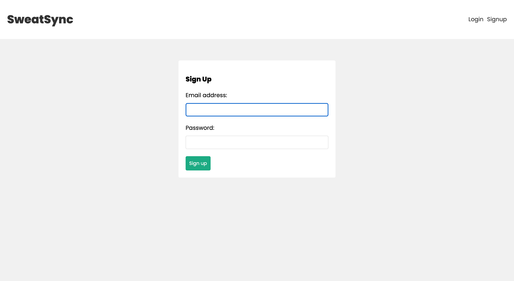
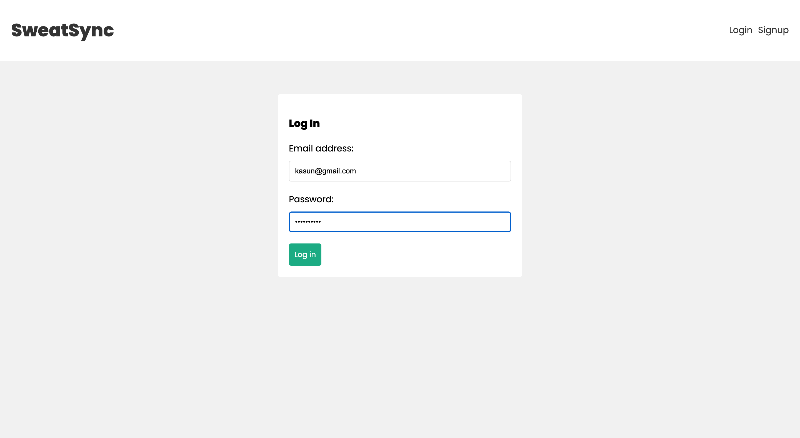
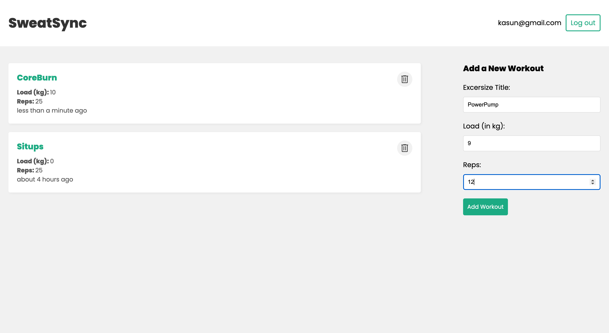
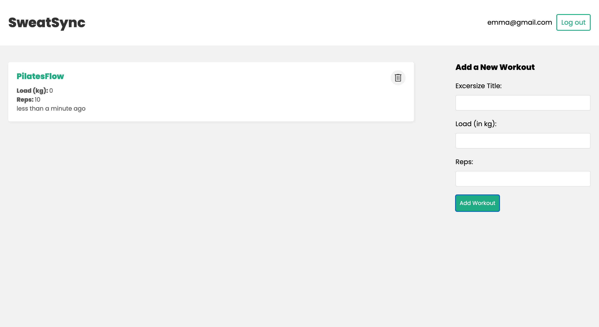
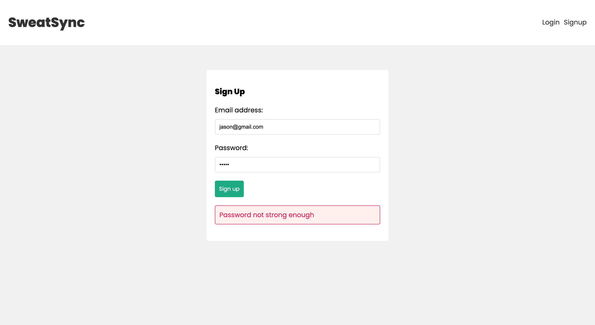
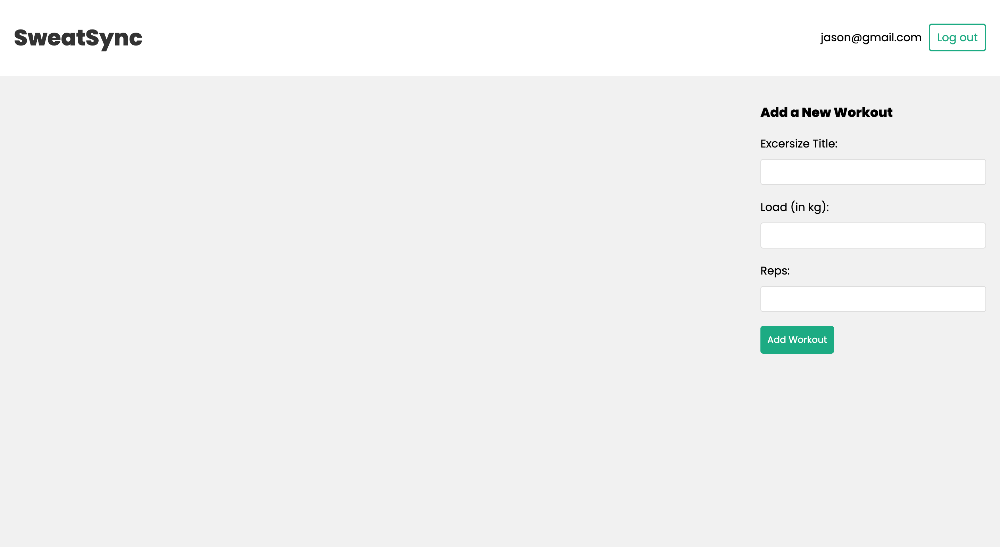

# WORK-OUT-APP MERN Stack

---

### Description.

---

### Languages & Tools

* React
* NodeJS
* Express
* MongoDB
* Visual Studio Code

---

# Project View.

Sign in

Sign up

Enter Login Details

User Dashboard

Another User Dashboard

Register New User

Password Validation

New User Dashboard

---
